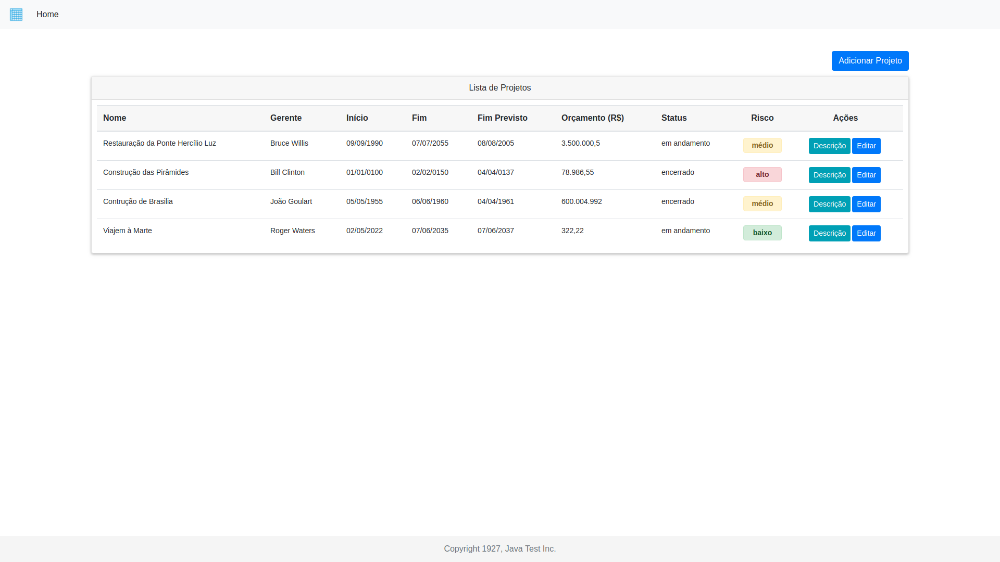
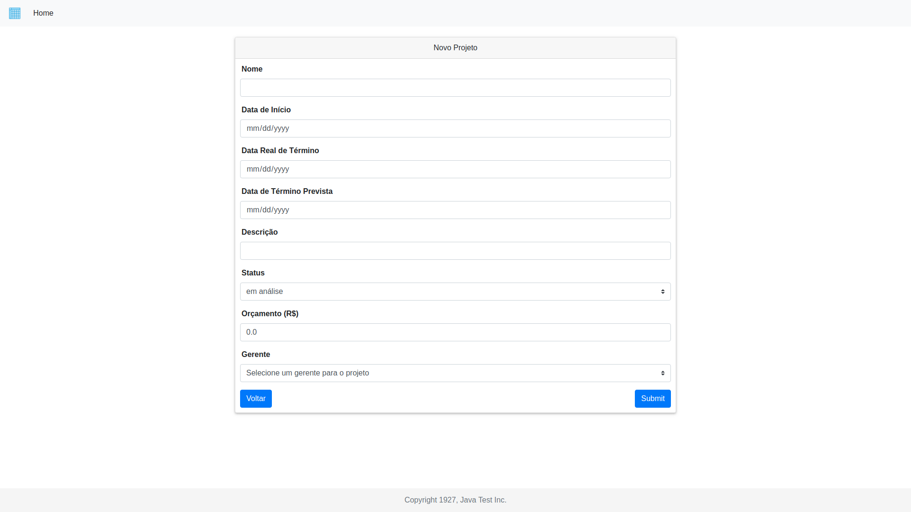

# *Teste Programador Java* #
Teste para programador Java Desbravador

## *Instalação* ##

### *Configuração do Banco de Dados* ###

O projeto utiliza o SGBD PostgresSQL com as seguintes configurações:
```
spring.datasource.url=jdbc:postgresql://localhost:5432/portproj
spring.datasource.username=postgres
spring.datasource.password=postgres
```

Ou seja, precisa existir uma base dados com o nome *portproj*, e um usuário com nome e senha *postgres*.

Mesmo havendo a instrução de que o script de estrutura das tabelas não deveria ser alterado, isso precisou ser feito por causa de erros na definição da tabela Membro:

`-- -----------------------------------------------------`<br/>
`-- Table Membros`<br/>
`-- -----------------------------------------------------`<br/>
`CREATE TABLE membros`<br/>
`( idprojeto bigserial NOT NULL, `<br/>
`idpessoa bigint NOT NULL,  `<br/>
`CONSTRAINT pk_membros_projeto PRIMARY KEY (idprojeto),`<br/>
`CONSTRAINT fk_membros_pessoa FOREIGN KEY (idpessoa)`<br/>
`REFERENCES projeto (id) MATCH SIMPLE`<br/>
`ON UPDATE NO ACTION ON DELETE NO ACTION,`<br/>
`CONSTRAINT fk_pessoa FOREIGN KEY (idpessoa)`<br/>
`REFERENCES pessoa (id) MATCH SIMPLE`<br/>
`ON UPDATE NO ACTION ON DELETE NO ACTION);`<br/>

A chave primária criada, deveria ser composta e incluir referências para pessoas e projetos, o que não ocorre no script, que define uma chave simples referênciado apenas projetos:

`CONSTRAINT pk_membros_projeto PRIMARY KEY (idprojeto),`

A próxima constraint também não faz muito sentido, pois ela faz o campo *idpessoa* referênciar o campo *id* da tabela *Projeto*, como pode ser visto abaixo:

`CONSTRAINT fk_membros_pessoa FOREIGN KEY (idpessoa)`<br/>
`REFERENCES projeto (id) MATCH SIMPLE`<br/>
`ON UPDATE NO ACTION ON DELETE NO ACTION,`

Resumindo, com essas configurações além de termos uma chave primária deficiente, o campo *idprojeto* não é relacionado à chave estrangeira alguma.

Para corrigir esses erros esse script foi editado e uma nova versão foi adicionada ao projeto:

https://github.com/acrackintheice/desafioJavaSpring/blob/master/spring-boot-jsp-jpa/src/main/resources/sql/create-tables.sql

### *Execução da aplicação* ###

Como as outras dependências do projeto são fornecidas pelo Maven, após a configuração do banco de dados a aplicação já pode ser executada, o que pode acontecer de duas formas: utilizando o spring-boot ou gerando o .war/.jar e um servidor web tradicional.

### Spring Boot ###

Para o executar o projeto com o spring-boot basta estar na pasta raiz do projeto (spring-boot-jsp-jpa), que não  a pasta raiz do repositório, e executar o comando:
```
mvn spring-boot:run
```

### Wildfly ###
Para executar o projeto no servidor Wildfly basta gerar um arquivo .war com o comando:
```
mvn clean install
```
Com isso o arquivo .war será gerado no caminho: 
```
/spring-boot-jsp-jpa/target/spring-boot-jsp-jpa.war
```
Para rodar a aplicação no Wildfly deve-se colocar o arquivo .war gerado no diretório
```
<path_to_wildfly>/standalone/deployments
```
e, para sistemas Linux, executar o script
```
<path_to_wildfly>/bin/standalone.sh
```

## *Demo* ##

Listagem de projeto:




Criação de Projetos (a edição usa a mesma tela):



### *Inserção de Dados* ###

## Pessoas ##

Não foram desenvolvidas interfaces web para inserção de novas pessoas no banco de dados, mas isso pode ser feito utilizando a interface REST gerada aumtomaticamente pelo spring-data-rest. 

Para inserir uma nova pessoa no sistema é necessário enviar um HTTP POST com os dados da pessoa no corpo da mensagem para o endereço http://localhost:8080/pessoas. Os exemplos abaixo mostram quais sãos os dados necessários para a criação de pessoas no sistema:
```
HTTP POST -> http://localhost:8080/pessoas
{
	"nome": "Bruce Willis",
	"dataNascimento": "2011-15-07T03:00:00.208Z",
	"cpf": "12345678912345",
	"funcionario": false
}
HTTP POST -> http://localhost:8080/pessoas
{
	"nome": "João Goulart",
	"dataNascimento": "1965-07-02T03:00:00.208Z",
	"cpf": "72849628132345",
	"funcionario": true
}
HTTP POST -> http://localhost:8080/pessoas
{
	"nome": "Bill Clinton",
	"dataNascimento": "1985-11-08T03:00:00.208Z",
	"cpf": "77777628132345",
	"funcionario": true
}
```

## Membros ##
Como descrito na tarefa, a inserção de membros pode ser feita via web services. Dessa forma, foi criada uma entrada no endereço http://localhost:8080/projetos/{id}/membros para recebimento de mensagens de inserção de pessoas(membros) em projetos. Dessa forma, para inserir um novo membro à um projeto, é necessrio enviar uma mensagem HTTP POST para o endereço http://localhost:8080/projetos/{id}/membros, onde {id} corresponde ao id do projeto no qual se pretende inserir o novo membro, contendo no corpo da mensagem o nome e função, em JSON, da pessoa a ser inserida como membro. Exemplo:
```
http://localhost:8080/projetos/34/membros
{
	"nome": "Bill Clinton",
	"funcao" : "Presidente"
}
```
OBS: O enunciado da pedia que a função do membro no projeto fosse informada, mas essa informação não existe no banco de dados e não é armazenada pelo sistema.
OBS: Como nenhuma das funcionalidades exgidas envolviam membros, essas informações nunca são exibidas pelo sistema.

## Projetos ##

A criação de novos projetos é realizada diretamente na interface web do sistema, no endereço http://localhost:8080/projetos/criar.

OBS: No momento algum problema está impossibilitando que o spring-data-rest gere uma api rest rest para a entidade Projeto, gastei bastante tempo nisso mas não consegui identificar o problema. 

## *Notas Finais* ##

**Testes**

Como o tempo acabou ficando curto para a realização das duas tarefas, Java e Frontend, não foi possível implementar os testes unitários para as regras de negócios descritas na tarefa.

**Regras de Negócio**

Algumas das regras de negócio não ficaram muito claras para mim, me pareceu haver incoerências entre as informaçes do pdf da tarefas e a estrutura base do sistema.
